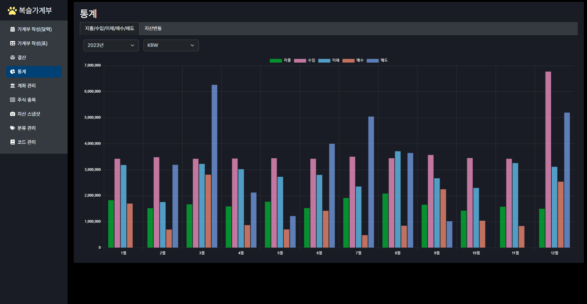
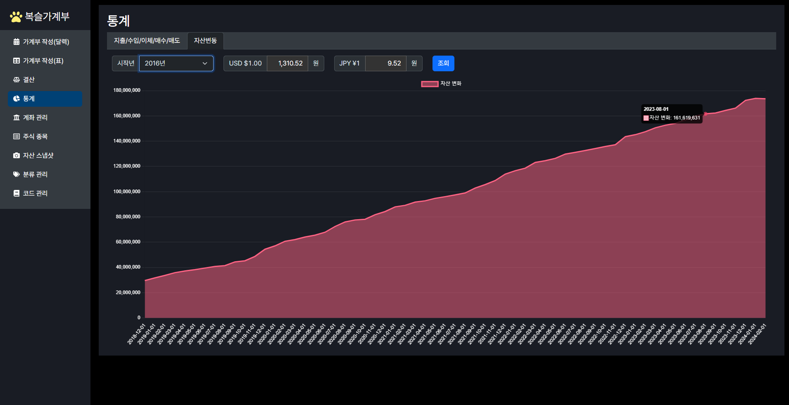

# 복슬가계부

[복슬머니](https://github.com/setvect/BokslMoneyApp) 후속작.<br/> 전작과 주요 차이점은 **외국통화**, **해외주식** 개념이 적용된 가계부 작성 기능 제공. 그리고 **다크 테마 UI** 적용.

## 1. 주요기능

- 계좌(통장, 카드, 주식 등) 등록 및 관리
- 다중 통화 관리
  - 환전
  - 환율이 적용된 자산 관리
- 주식 매매
  - 국내 주식 매매
  - 외국 주식 매매
- 달력 및 목록 방식 조회
- 자주쓰는 거래 내역 등록(단축키 입력)
- 년단위 기준 월 결산
- 결과 목록 엑셀 내보내기
- 분류 및 각종 코드관리
- 수입/지출/이체 내역 및 자산 변동 통계
  - 환율이 적용된 자산 가치 산출

## 2. 실행 및 빌드

### 2.1. 초기셋팅

```shell
$ npm install

$ cd release/app
$ npm install
```

### 2.2. 실행 방법

```shell
$ npm start
```


### 2.3. 빌드 방법 (인스톨 파일 생성)

```shell
$ npm run package
```

- 빌드 결과는 `release/build` 폴더에 생성됨

## 3. 설계 문서
 
- [테이블 설계서](doc/TABLE-SCHEMA.md)

## 4. 주요화면

- 달력 보기


- 지출 입력


- 목록 보기


- 주식 매매 내역


- 결산 내역


- 월별 수입/지출/이체/매수/매도 그래프


- 자산 변환 그래프


- 계좌 목록


- 자산 스냅샷


- 분류 관리


## 5. 개발환경

프로젝트 초기환경은 [electron-react-boilerplate](https://github.com/electron-react-boilerplate/electron-react-boilerplate)를 기반으로 만들었음.

### 5.1. 주요 프레임워크 및 라이브러리

상세 버전은 [package.json](package.json)를 확인

- [typescript](https://www.typescriptlang.org)
- [electron](https://www.electronjs.org)
- [react](https://ko.legacy.reactjs.org)
- [sqlite3](https://www.sqlite.org)
- [React Bootstrap](https://react-bootstrap.netlify.app)
- [FullCalendar](https://fullcalendar.io)
- [react-hook-form](https://react-hook-form.com/)
- [moment](https://momentjs.com/)
- [lodash](https://lodash.com/)
- [Pretendard 글꼴](https://github.com/orioncactus/pretendard)

## 6. 관련 정보

### 6.1. 문제 해결에 도움이 된 사이트

- 대부분의 문제는 [GPT4](https://chat.openai.com/)에게 질문하여 해결 했음

### 6.2. 릴리즈

[RELEASE.md](RELEASE.md) 참고

### 6.3. 꿀팁

#### 6.3.1. 샘플 데이터 만들기

지출, 수입, 이체, 주식 거래, 환전등 각종 초기 데이터를 만들고 테스트 할 수 있도록 할 수 있음. 방법은 두 가지.

1. [SampleDataMakerService.test.ts](src/__tests__/SampleDataMakerService.test.ts) 테스트 코드 실행
2. 개발 환경으로 실행 후 메뉴 항목 에서 '복슬가게부' → '샘플 데이터 만들기'선택

개발 실행 모드에서만 가능

#### 6.3.2. main process 자동 실행 방지 방법 - package.json 수정

개발환경 프로그램 실행한 상태에서 main process 소스코드를 수정하면 어플리케이션이 다시 실행되어 불편한 경우가 있음. 이때 아래처럼 설정을 수정하면 됨.

- 수정전: `"start:main": "cross-env NODE_ENV=development electronmon -r ts-node/register/transpile-only ."`
- 수정후: `"start:main": "cross-env NODE_ENV=development electron -r ts-node/register/transpile-only .","`

#### 6.3.3. 프로그램 로그

인스톨 후 로그 파일 저장되는 경로

- 윈도우: `C:\Users\[사용자 이름]\AppData\Roaming\boksl-account-book\logs`
- 맥: `~/Library/Logs/boksl-account-book/logs`

#### 6.3.4. DB 파일 저장 경로

[AppDataSource.ts](src/main/config/AppDataSource.ts) `DB_PATH` 변수 참고

- 개발환경 실행 시: `db/BokslAccountBook.db` (상대경로)
- 윈도우: `C:\Users\[사용자 이름]\AppData\Roaming\boksl-account-book\BokslAccountBook.db`
- 맥: `~/Library/Application Support/boksl-account-book/BokslAccountBook.db`
